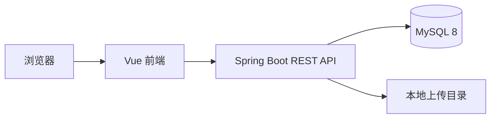

# 系统设计

## 架构

系统采用前后端分离架构。Vue 负责页面和交互，Spring Boot 负责业务规则、权限校验和数据访问。前端通过 `/api` 访问后端，生产环境由 Nginx 托管前端构建产物并反向代理 API。

## 前端分区

- 门户区：`frontend/src/views/portal`，公开文章浏览与详情阅读。
- 用户区：`frontend/src/views/portal/UserCenter.vue`，登录用户创作和资料维护。
- 管理区：`frontend/src/views/admin`，管理员后台。
- API 封装：`frontend/src/api/blog.js`。
- 登录态：`frontend/src/stores/auth.js`。

## 后端分层

- Controller：接收 HTTP 请求，做接口分组。
- Service：承载业务规则，例如文章发布、公开详情、点赞收藏、评论审核。
- Mapper：MyBatis-Plus 数据访问。
- Entity：数据库表映射。
- DTO：前端展示或提交数据模型，避免直接暴露完整实体。

## 核心数据模型

- `blog_user`：用户、角色、状态、头像和邮箱。
- `article`：文章标题、摘要、封面、正文、状态、浏览量、点赞数、收藏数。
- `category`：文章分类。
- `tag` 与 `article_tag`：文章标签和多对多关系。
- `comment`：文章评论。
- `like_record`：用户点赞记录。
- `favorite`：用户收藏记录。
- `image_resource`：站点图片资源。

## 文章展示模型

前台列表使用 `ArticleCardResponse`，只返回卡片需要的数据，不返回正文。前台详情使用 `ArticleDetailResponse`，在卡片字段基础上增加 `content` 和 `contentType`。

这样可以保持首页轻量，也让“卡片浏览，点开后显示内容”的产品逻辑更加明确。

## 权限规则

- 游客：访问首页、公开文章列表、文章详情和已审核评论。
- 登录用户：发布文章、编辑本人文章、删除本人文章、评论、点赞、收藏、维护个人资料。
- 管理员：访问 `/admin`，管理文章、评论、分类、标签、用户和图片资源。

## 待增强点

- 点赞/收藏已支持 toggle 和计数同步，但详情页暂未初始化“当前用户是否已点赞/收藏”的状态。
- 评论目前公开列表只展示已审核评论，可继续补充回复、删除本人评论和敏感词审核。
- 后台可增加文章审核状态，例如 `PENDING`、`REJECTED`。
- 前端可继续抽取通用列表、表单和上传组件。
